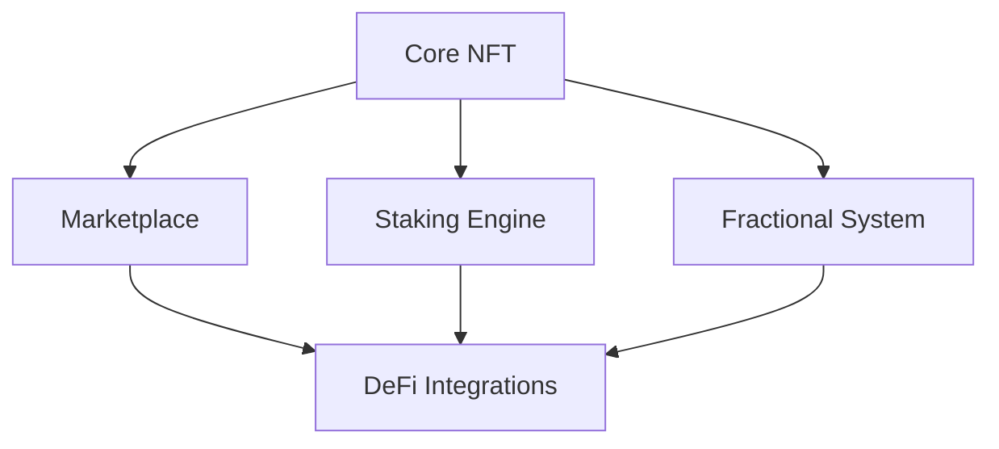

# DeFi-Enabled NFT Marketplace Protocol

A revolutionary protocol combining NFT ownership with advanced DeFi primitives on the Stacks blockchain. Enables collateralized NFT creation, decentralized trading, yield generation, and fractional ownership with institutional-grade security.

## Key Features

### Core NFT Operations

- **Collateralized Minting**: Create NFTs with dynamic collateral requirements
- **Secure Transfers**: Ownership management with staking locks
- **Metadata Standards**: Immutable URI storage with validation

### DeFi Integrations

- **Protocol-Owned Liquidity**: 2.5% fee on all transactions
- **Yield Generation**: 5% APY staking rewards
- **Collateral Management**: 150% minimum collateral ratio

### Marketplace Engine

- Trustless NFT trading
- Dynamic price discovery
- Atomic swap execution

### Fractional Ownership

- Share-based ownership system
- Secondary market transfers
- Proportional revenue rights

## Technical Specification

### Protocol Parameters

| Parameter              | Value  | Description                     |
| ---------------------- | ------ | ------------------------------- |
| `min-collateral-ratio` | 150%   | Minimum collateralization ratio |
| `protocol-fee`         | 25bps  | Transaction fee (0.25%)         |
| `yield-rate`           | 500bps | Annual staking yield (5%)       |

### Contract Architecture



### Security Model

- Principal-based access control
- Overflow-protected arithmetic
- State transition validation
- Reward distribution safeguards

## Core Functions

### NFT Management

| Function       | Parameters            | Description                            |
| -------------- | --------------------- | -------------------------------------- |
| `mint-nft`     | (uri, collateral)     | Creates NFT with collateral lock       |
| `transfer-nft` | (token-id, recipient) | Ownership transfer with staking checks |

### Marketplace Operations

| Function       | Parameters        | Description                        |
| -------------- | ----------------- | ---------------------------------- |
| `list-nft`     | (token-id, price) | Creates active marketplace listing |
| `purchase-nft` | (token-id)        | Executes trustless NFT swap        |

### Financial Features

| Function          | Parameters                    | Description                       |
| ----------------- | ----------------------------- | --------------------------------- |
| `stake-nft`       | (token-id)                    | Locks NFT for yield generation    |
| `unstake-nft`     | (token-id)                    | Releases NFT with reward claim    |
| `transfer-shares` | (token-id, recipient, shares) | Moves fractional ownership rights |

## Error Reference

| Code | Error                | Description               |
| ---- | -------------------- | ------------------------- |
| 100  | Owner Only           | Restricted admin function |
| 101  | Not Owner            | Unauthorized token access |
| 102  | Insufficient Balance | Failed transfer attempt   |
| 103  | Invalid Token        | Nonexistent NFT ID        |
| 107  | Already Staked       | Duplicate staking attempt |

## Development Guide

### Prerequisites

- Clarinet SDK 2.0+
- Stacks.js 4.0+
- Node.js 16.x

### Contract Interaction

**Minting Example**

```clarity
(contract-call? .nft-marketplace mint-nft "ipfs://Qm..." u1000000)
```

**Staking Workflow**

```clarity
;; Stake NFT
(contract-call? .nft-marketplace stake-nft u42)

;; After 100 blocks
(contract-call? .nft-marketplace unstake-nft u42)
```

### Query Methods

```clarity
;; Get NFT metadata
(contract-call? .nft-marketplace get-token-info u42)

;; Check listing status
(contract-call? .nft-marketplace get-listing u42)
```

## Security Considerations

1. **Collateral Risks**

- Maintain 150%+ collateralization ratio
- Monitor price volatility of collateral assets

2. **Staking Safeguards**

- Rewards calculated per-block
- Minimum 1 block staking duration

3. **Fractional Ownership**

- Share dilution protection
- Transfer validation checks
